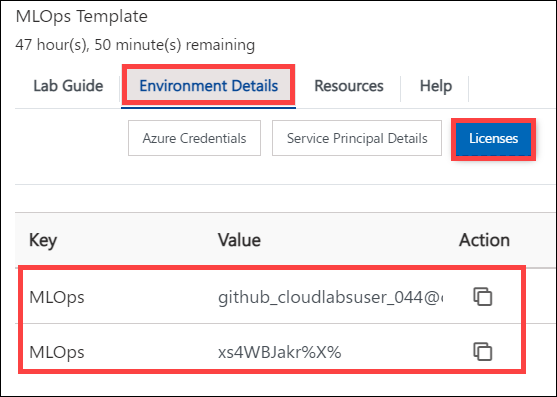
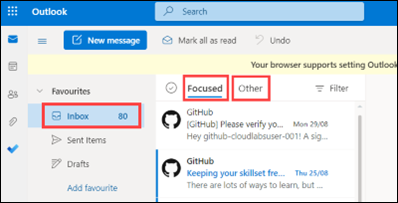
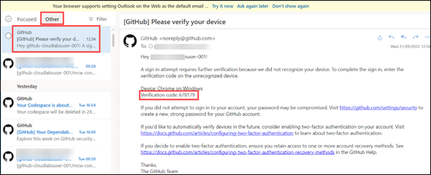
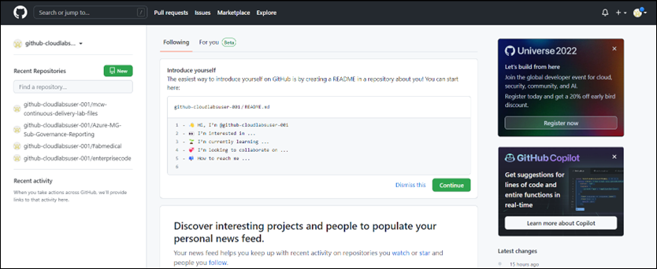
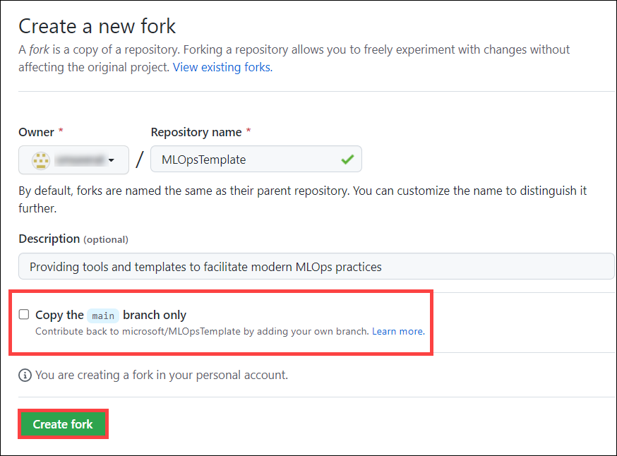
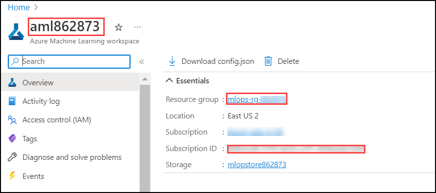
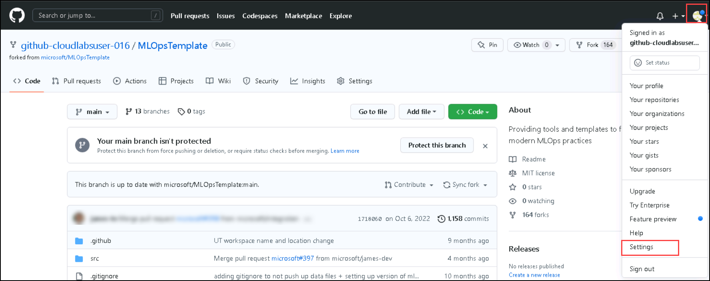
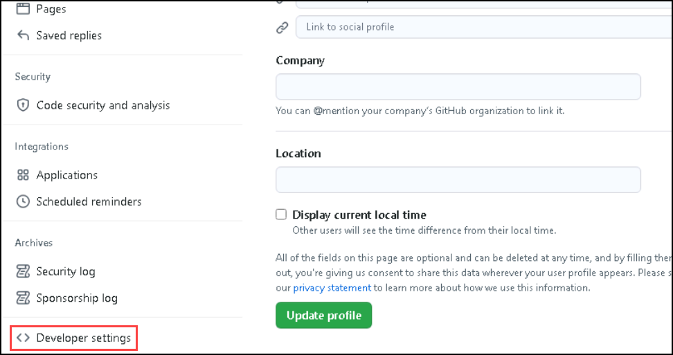
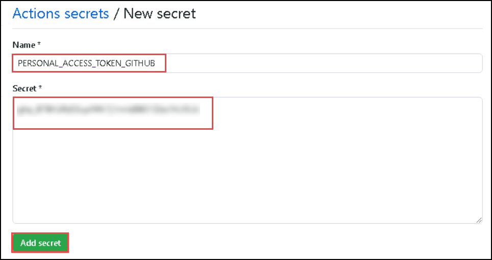
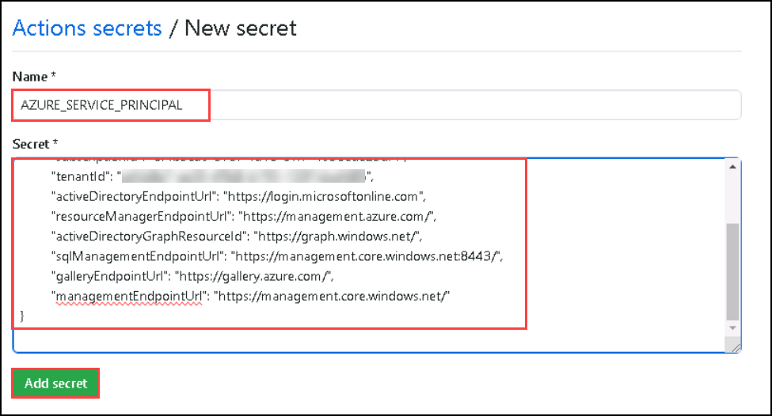

# Part 0: Workshop Environment Setup
> Note: Read the Workshop scenario overview [here](https://github.com/microsoft/MLOpsTemplate/blob/main/src/workshop/README.md#workshop-scenario)

## Goal
- Setup Azure ML workspace and components
- Setup github account, a personal access token and configure settings
- Setup local python development environment
- Generate and register data for the workshop
- Setup SP (Service Principal)


## Task 1. Setup Github Account and Settings

  1. From the new browser tab, Sign in to the [Github](https://github.com/login) using the **GitHub Credentials** provided under the **Environment details > Licenses** tab.
 
    
  
2.	Enter both the username and password, and click on Sign in.

   

3.	GitHub will ask for Device Verification.
 
4.	To get the verification code, browse to https://outlook.live.com/owa/ and sign in using same GitHub user credentials that you used earlier in step 2.

5.	Once you sign in, check for the latest email from GitHub. It could be in either Focused or Other section of the Inbox.

    
 
6.	Here, I can see the latest mail from GitHub is under Other section. So open the mail and copy the Verification code.

   

7.	Paste the verification code in Device verification code field. As soon as you paste the code, it will go to verifying state.

    

8.	After providing the code you will be successfully logged in to Github as shown below.

  

9. After the login, go to [https://github.com/microsoft/MLOpsTemplate](https://github.com/microsoft/MLOpsTemplate) and click `Fork`.
  

10. Make sure to **uncheck** the `copy the main branch only option` and click `Create Fork`. 

     
   
> **Note:** You will have the same repository (`MLOpsTemplate`) under your Github account name.
   > Leave the tab open and **do not** close it yet. You will come back to your repository.

## Task 2. Choose your development environment
In this step you will clone the above forked repository into a development environment. 

###  Using Compute Instance in AML

1. In the Azure portal, go to ***mlops-rg-<inject key="Deployment ID"></inject>*** resource group and open **aml-<inject key="Deployment ID"></inject>** machine learning workspace.

2. In **aml-<inject key="Deployment ID"></inject>** machine learning workspace, click on **Launch Studio** button.

3. Go to __Compute__ > __Compute Instance__.

4. Click new __Terminal link__.

5. Clone __your__ 'MLOpsTemplate' repo in the Terminal of Compute Instance.

    - Make sure you have forked the repo to your repository
    - Before you run following command, update the _{YOURGITHUBACCOUNT}_ part with your GitHub handle (look at your browser URL for the repo you forked earlier to get this information)
    - Run the following command to clone the repo:
     ```bash
     git clone https://github.com/{YOURGITHUBACCOUNT}/MLOpsTemplate.git
     ```

> **Note:** Make sure you are running the command from a similar path structure like below:
> `~/cloudfiles/code/Users/YOURALIAS$`


> **IMPORTANT:** setup Git credentials helper (to avoid typing your username / password every time you push some changes).

```bash
git config --global credential.helper store
```

> **IMPORTANT:** Git push commands setup (replace with the email linked to your github account + specify your full name).

```bash
git config --global user.email "my_email@my_company.com"
git config --global user.name "Firstname Lastname"
git config --global push.default simple
```

6. Generate and register data for the workshop.

    - Update arguments "_NAMES_ and _ID_" accordingly and then run following commands from the Terminal.

        ```bash
        cd ./MLOpsTemplate/src/workshop
        conda env create -f conda-local.yml
        conda activate mlops-workshop-local
        python ./data/create_datasets.py --datastore_name workspaceblobstore --ml_workspace_name "AML_WS_NAME" --sub_id "SUBSCRIPTION_ID" --resourcegroup_name "RG_NAME"
        ```
        
> **Note:** You can find the __Resource Group Name, Azure Machine Learning Worskspace Name__ and the __Subscription ID__ from Azure portal.
> 

   - Use the code and follow the instruction to finish the login.
   
   > **Note:** You need to login in and be authenticated to use the `azure cross platform CLI`.
        After copy the __code__ and go to the link, [https://microsoft.com/devicelogin](https://microsoft.com/devicelogin). 

7. Install az ml CLI v2.
    - Run the following command to see the `az extension`
        ```bash 
        az extension list
        ```
    - If you see the `azure-cli-ml` extension, remove it by running the following command: 
         ```bash 
         az extension remove -n azure-cli-ml
         ```
    - If you see `ml` extension, remove it by running the following command:
         ```bash 
         az extension remove -n ml
         ```
    - Install the latest az `ml` CLI v2 extension by running the following command:
        ```bash 
        az extension add -n ml -y --version 2.2.1
        ```

8. Setup az cli.
    - Run the following command from the Terminal:
        ```bash
        az login
        ```
        If you have access to more than 1 tenants, it's advisable to use the syntax below with a designated tenant id to logon to the right tenant
        ```bash
        az login --tenant "<YOUR_TENANT_ID>"
        ```
        Use the code and follow the instruction to finish the login.
    > **Note:** You need to login in and be authenticated to use the `az cli` extension.
        
        After copy the __code__ and go to the link, [https://microsoft.com/devicelogin](https://microsoft.com/devicelogin). 
        


9. Configure the subscription and Azure Machine Learning Workspace.
    ```bash
    az account set -s "<YOUR_SUBSCRIPTION_NAME>"
    az configure --defaults group="<YOUR_RG_NAME>" workspace="<YOUR_AML_NAME>" location="<YOUR_REGION_NAME>"
    az configure -l -o table
    ```
    
  > **Note:** You can find the __Subscription Name__,__Resource Group Name__, __Azure Machine Learning Name__ and __the Location__ from the user profile in the AML Studio.
    

 > **Note:** The results should look like the following:
    


 > **Note:** Once done, **leave the terminal open**. **Do not terminate it** and head to the next task.

## Task 3. Configure secret in your Github account

The last two tasks include:
   - Creating a Personal Access Token (PAT) in Github.
   - Adding a Service Principal (SP) to your forked repository in Github.


### 3.1 Create PAT (Personal Access Token)

You are going to create PAT to allow your code access your personal git repo.

1. To make PAT, you need to go to Settings of your account, **NOT** repo setting.

    

2. From the setting, find and __click__ '_<> Developer settings_' menu at the bottom left conner of your screen.

    

3. __Click__ on '_Personal access tokens_' (1)> '_Tokens (classic)_' (2) and then __click__ on '_Generate new token_' (3)> '_Generate new token (classic)_' (4).

    

4. Enter a **Note** and check for '_repo_' and '_workflow_' for the scope and then __click__ '_Generate Token_' at the bottom of your screen.

    

5. You'll see the token. Make sure you copy and keep it safe. 

    

6. Now you're going to add the token to your repo, Go back to your 'MLOpsTemplate' repo where your forked from microsoft/MLOpsTemplate.

    - The url of your repo will looks like this.

        ```text
        https://github.com/{YOURACCOUNT}}/MLOpsTemplate
        ```

7. From your repo __click__ '_Settings_'.

    

8. Find a menu '_Secrets_' on the left side of menu, and __click__ 'Actions'. After that __Click__ 'New repository secret'.

    

9. Type `PERSONAL_ACCESS_TOKEN_GITHUB` for the name of the secret, and paste the token you copied from PAT section and click **Add Secret**.

    > **Important:** The name for this secret must be `PERSONAL_ACCESS_TOKEN_GITHUB`.

    


### 3.2 Add SP to your repo in Github

From this section, you'll add the SP information to your repo. The SP information will be used during the Github Actions.


1. Go back to your 'MLOpsTemplate' repo where your forked from microsoft/MLOpsTemplate.

    - The url of your repo will looks like this.

        ```text
        https://github.com/{YOURACCOUNT}}/MLOpsTemplate
        ```

2. From your repo __click__ '_Setting_'.

    

3. Find a menu '_Secrets_' on the left side of menu, and __click__ 'Actions'. After that __Click__ 'New repository secret'

    

4. Type `AZURE_SERVICE_PRINCIPAL` for the name of the secret.
5. Now, locate the AZURE_SERVICE_PRINCIPAL.txt file in desktop under your LabVM and open it.
6. Copy the whole SP json definition and paste it in Github under **value box** and click **Add Secret**.

    > **Important:** The name for this secret must be `AZURE_SERVICE_PRINCIPAL`.

    


