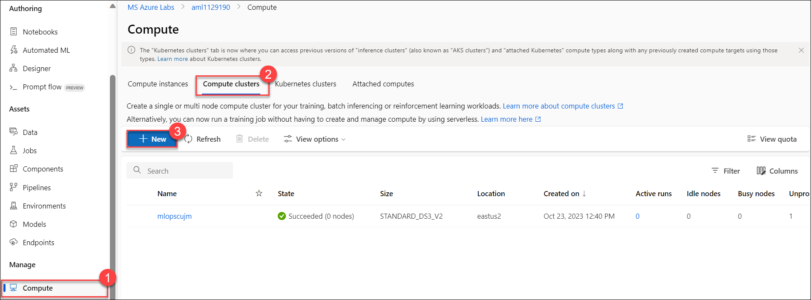
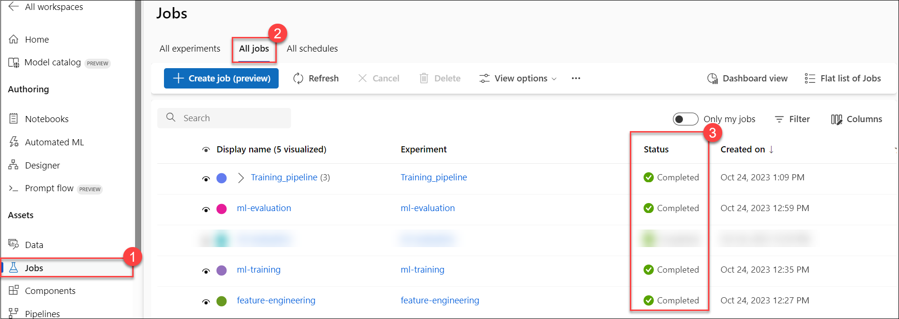

# Part 2: Use cloud scale compute to run, deploy and manage ML experiments with Azure ML

## Pre-requisites
- Complete [Part 0], [Part 1]
- Run each module feature_engineering, ml_training and evaluating successfully in local mode
- Have Azure ML workspace setup with a Compute Cluster named ```cpu-cluster```

## Summary 
After successfully restructuring the Jupyter Notebook and running modules locally, your team wants to leverage Azure Cloud to run the experiment at scale.
They also want to take advantage of experiment tracking and model management capabilities in Azure ML to keep track of experiments. 
Finally, the team wants to deploy the model as a rest endpoint for real-time inferencing and experience the option of deploying it as batch inferencing.
To accomplish these goals, you will perform the following:
- Run feature_engineering module as a job in Azure AML 
- Run the ml_training module as a job in Azure ML and observe the experiment metrics 
- Run evaluating module as a job in Azure ML and observe how the model can be registered to Azure ML model's repo
- Run the three modules together as a pipeline
- Deploy and test the produced ML model as an API using Azure Managed Online Endpoint


## Task 1:
1. In Azure machine learning workspace studio, go to **Compute (1)** under **Manage** and click **Compute clusters (2)**.

1. Click **+ New (3)**.

   

1. Under **Create compute cluster**, on Virtual Machine tab leave the default values and click **Next**.

1. Under **Advanced settings**, give compute name as `cpu-cluster` leave the default values and **Create**.

1. Select **Notebooks** under **Authoring** section. Go to the workshop folder. (Skip this step if you are already in the workshop folder from the previous task)
   
   >**Action Item:** Run the following code snippet.

   ```bash 
   cd src/workshop
   ```
1. Set default values to configure your resource group and workspace.
   
   >**Action Item:** Run the following code snippet and replace YOUR_RESOURCE_GROUP and YOUR_WORKSPACE with ***mlops-rg-<inject key="Deployment ID"></inject>*** and **aml<inject key="Deployment ID"></inject>** respectively.
    
   ```bash 
   az configure --defaults group=YOUR_RESOURCE_GROUP workspace=YOUR_WORKSPACE
   ```

1. Run the ```feature_engineering.py``` module under the ```data_engineering``` folder by following the steps below:
 
   >**Action Items:** Run the following code snippet:
   
   ```bash 
   az ml job create -f core/data_engineering/feature_engineering.yml 
   ```
   
   >**Note:** Select **Jobs** under **Assets**. Select **All jobs**. Select the **feature_engineering** job and locate the run detail for this experiment.

1. Run the ```ml_training.py``` module under the ```training``` folder by following the steps below:
   
   >**Action Items:** Run the following code snippet:
      
   ```bash 
   az ml job create -f core/training/ml_training.yml 
   ```
   
   >**Note:** Select **Jobs** under **Assets**. Select **All jobs**. Select the **ml_training** job and locate the run detail for this experiment.

1. Run the ```ml_evaluating.py``` module under the ```evaluating``` folder by following the steps below:
   
   >**Action Items:** Run the following code snippet:

   ```bash 
   az ml job create -f core/evaluating/ml_evaluating.yml 
   ```
   
   >**Note:** Select **Jobs** under **Assets**. Select **All jobs**. Select the **ml_evaluating** job and locate the run detail for this experiment. Observe the ML metrics and how the model was logged to Azure ML's model registry.

   >**Note:** Please wait for the '_feature_engineering_', '_ml_training_', and '_ml_evaluating_' job statuses to show **Completed**.

1. Once the statuses are in completed state, select **Notebooks**, to perform the further steps.

1. Create a pipeline that runs the feature_engineering, training and evaluation in one workflow.
   
   >**Action Items:** Run the pipeline, by running the following code snippet.
   
   ```bash 
   az ml job create -f core/pipelines/training_pipeline.yml 
   ```
   
   >**Note:** Select **Jobs** under **Assets**. Select **All jobs**. Select the **Training_pipeline** and observe the relationship graph among the modules. (See chart below as well.)

   >**Note:** Please wait for the **Training_pipeline** job status to show **Completed**.

1. Discuss this question: Why should we run the modules both individually and together in a pipeline? 

1. Deploy to Azure ML Managed Online Endpoint by following the steps below:
 
   >**Action Items:**
   
   >- In AML Studio, under Authoring navigate to the **Notebooks > MLOpsTemplate > src > workshop > core > scoring**
   
   >- Select **endpoint.yml** under scoring folder.
   
   >- Update the ```endpoint.yml``` file by updating the name of the endpoint (should be a unique name) and press Ctrl+S to save the change (If prompted for authentication first click **Authenticate** then press Ctrl+S.)
   
   >- Select **deployment.yml** under scoring folder.

   >- Update the ```deployment.yml``` file by updating the name of the endpoint (should be the same name you defined just above) and Press Ctrl+S to save the change.
   
   > -  Move back to the notebook Terminal and create your endpoint by running the following command:
   
   ```bash 
   az ml online-endpoint create --file core/scoring/endpoint.yml 
   ```
   
   >**Note:** Select **Jobs (1)**, under **Assets**. Select **All Jobs (2)**. Now, check the **Status (3)** for all the jobs, it's in completed state. If any one of these are not in completed state, wait until the completion of the job and then only move to the next step.
   
   
 
   >**Note:** Go back to **Notebooks** terminal.
   
1. Create a green deployment by running the following command:
  
   ```bash 
   az ml online-deployment create --file core/scoring/deployment.yml 
   ```

   >**Note:** At this point, it takes about 10 minutes to create a green deployment.
 
 1. Copy the **Endpoint Name** that is generated as the output of this command and save it in Notepad as it will be used in the next command.
 
 1. Test the deployed service with mock-up data from scoring_test_request.json
  
    >**Action Items:** Run the following code snippet and replace YOUR_ENDPOINT_NAME with **Endpoint Name** that you saved in the previous step.
   
    ```bash 
    az ml online-endpoint invoke -n YOUR_ENDPOINT_NAME --deployment green --request-file core/scoring/scoring_test_request.json 
    ``` 
    >- Observe the returned scores from the endpoint evaluation.

### The entire training pipeline is illustrated in this diagram


## Success criteria
- Run the modules individually in Azure 
- Capture metrics and models in ml_training and ml_evaluating modules
- Run three modules together in a pipeline
- Model is deployed successfully to the managed endpoint. 
- Testing is successful

## Reference materials
- [Azure ML CLI v2 tutorial](https://docs.microsoft.com/en-us/learn/paths/train-models-azure-machine-learning-cli-v2/)
- [Azure ML CLI single job examples](https://github.com/Azure/azureml-examples/tree/main/cli/jobs/single-step)
- [Azure ML CLI pipeline examples](https://github.com/Azure/azureml-examples/tree/main/cli/jobs/pipelines)
- [Deploy to managed online endpoint](https://docs.microsoft.com/en-us/azure/machine-learning/how-to-deploy-managed-online-endpoints)
- [Deploy to batch endpoint](https://docs.microsoft.com/en-us/azure/machine-learning/how-to-use-batch-endpoint)

